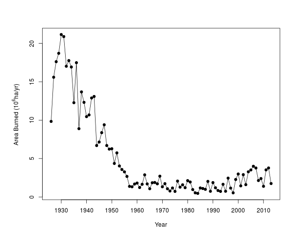

This repository includes data about annual fire burned area in the USA since 1926. Data from 1926 to 1959 came from [here](http://www.census.gov/prod/www/statistical_abstract.html). Or you can just download `fireUS1926_1959.csv`, which was digitized from `fireUS1926-1970.pdf` in this repository. Data from 1960 to 2013 came from [here](http://www.nifc.gov/fireInfo/fireInfo_stats_totalFires.html).

The figure at the end is in the appendix of this paper:
>Daijiang Li and Donald Waller. In press. Drivers of observed biotic homogenization in pine barrens of central Wisconsin. Ecology. [url](http://www.esajournals.org/doi/abs/10.1890/14-0893.1)

Here is the R code to extract the recent data from online and plot it.
```{r}
library(XML)
library(stringr)

fire.url = "http://www.nifc.gov/fireInfo/fireInfo_stats_totalFires.html"
fire.1960.2013 = readHTMLTable(doc = fire.url)
str(fire.1960.2013)
fire.1960.2013 = fire.1960.2013[[1]]
fire.1960.2013 = fire.1960.2013[-1,]
fire.1960.2013 = fire.1960.2013[-c(nrow(fire.1960.2013), 
                                   (nrow(fire.1960.2013)-1)),]
names(fire.1960.2013) = c("Year", "Fires", "Acres")
fire.1960.2013 = fire.1960.2013[-1,]
str(fire.1960.2013)
fire.1960.2013$Year = as.numeric(as.character(fire.1960.2013$Year))
fire.1960.2013$Fires = str_replace_all(string = fire.1960.2013$Fires, 
                                       pattern = "[,*]", replacement = "")
fire.1960.2013$Acres = str_replace_all(string = fire.1960.2013$Acres, 
                                       pattern = "[,*]", replacement = "")
fire.1960.2013$Fires = as.numeric(as.character(fire.1960.2013$Fires))
fire.1960.2013$Acres = as.numeric(as.character(fire.1960.2013$Acres))
str(fire.1960.2013)

fire.1926.1959 = read.csv("fireUS1926_1959.csv", header = T)
str(fire.1926.1959)

fire = rbind(fire.1960.2013, fire.1926.1959)

fire$ha=fire$Acres*0.404686
fire$ha.10e6=fire$ha/1000000
png(file = "fireUS.png", width = 600)
par(mar=c(5,6,4,2))
plot(fire$Year, fire$ha.10e6, type="o",pch=19, xaxt="n", xlab="Year", 
     ylab=expression(paste('Area Burned (', 10^{6}, 'ha/yr)',sep=" ")))
axis(side=1, at=seq(1930,2010,by=10))
dev.off()
```

